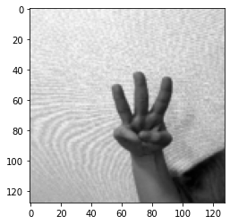
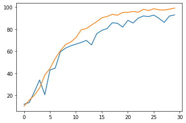
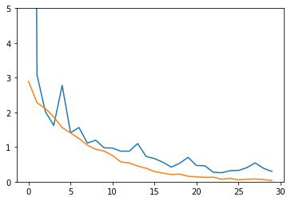

# Sign Language Classifier

## Author: Seung Hun Han
## Date: May 19th 2022


Description:

Classify images that expresses number between 0 to 10 in sign language.

Ex)
Image:


Label:

0

Data Source: https://dacon.io/competitions/official/235896/overview/description


```python
import os # Import modules
import torch
import pandas as pd
import numpy as np
from glob import glob
import torchvision.transforms as transforms 
from torch.utils.data import DataLoader
from torch.utils.data import DataLoader, Dataset
import random
from tqdm import tqdm
```


```python
device = torch.device('cuda') if torch.cuda.is_available() else torch.device('cpu')
# use GPU for compuation if available
```


```python
import random
def seed_everything(seed):  # To ensure reproducibility, set seed for entire process.
    random.seed(seed)
    os.environ['PYTHONHASHSEED'] = str(seed)
    np.random.seed(seed)
    torch.manual_seed(seed)
    torch.cuda.manual_seed(seed)
    torch.backends.cudnn.deterministic = True
    torch.backends.cudnn.benchmark = True

CFG = {
    'IMG_SIZE':128, #Image Size
    'EPOCHS':25, #Epochs
    'LEARNING_RATE':2e-2, #Learning Rate
    'BATCH_SIZE':12,
    'SEED':41,
}
seed_everything(CFG['SEED'])
```


```python
label=pd.read_csv('./user_data/train.csv')['label'] # Load Label data
```


```python
label[label=='10-1']=10  # Sign language that represents "number ten" is lablled as 10-1. 
label[label=='10-2']=0 # Sign language that represents "number zero" is lablled as 10-2. 
label=label.apply(lambda x: int(x)) # Convert label data to integer data
```


```python
image_path=[]
```


```python
data_dir='./user_data/'

def data_import(directory,train=True): # Function that loads all directory of train and test image
    image_path=[]
    label_list=[]
    if train==True:
        image_path.append(glob(os.path.join(data_dir,'train/*.png')))
        label_list.extend(label)
        return image_path, label
    else:
        image_path.append(glob(os.path.join(data_dir,'test/*.png')))
        return image_path
```


```python
train_img_path, train_label=data_import(data_dir,train=True) # Load train image directory and train label
```


```python
test_img_path=data_import(data_dir,train=False) # Load test image directory and test label
```

## Data Augmentation

Vision deep learning dataset usually requires enormous sample size to prevent overfitting.
Our train dataset, size smaller than 1000, is simply not large enought to produce a decent model.
One way to resolve such issue is 'data augmentation'

Data augmention is simply creating several additional images from an image.

Proceess like Crop, Rotation, Mirroring creates set of images are structually different from an original image, yet still adequate for model training.

Ex)


Ideally, at least ten thousand train data would be required for quality result. For now, I will only triple the original train data.


```python
import cv2
```


```python
from PIL import Image

total_origin_image_num = len(train_img_path[0])
augment_cnt = 1

for i in tqdm(range(1, 2000)):
    
    change_picture_index = random.randrange(1, total_origin_image_num-1) # Randomly choose an image
    print(change_picture_index)

    origin_image_path = train_img_path[0][change_picture_index]
    print(origin_image_path)
    image = Image.open(origin_image_path)
    random_augment = random.randrange(1,4) # Randomly choose a augmentation process to be implemented.
    
    if(random_augment == 1):
        #Mirroring Image
        print("invert")
        inverted_image = image.transpose(Image.FLIP_LEFT_RIGHT)
        inverted_image.save(origin_image_path + 'inverted_' + str(augment_cnt) + '.png')
        
    elif(random_augment == 2):
        #Rotate Image
        print("rotate")
        rotated_image = image.rotate(random.randrange(-90, 90))
        rotated_image.save(origin_image_path + 'rotated_' + str(augment_cnt) + '.png')
        
    elif(random_augment == 3):
        #Adding Noise
        img = cv2.imread(origin_image_path)
        print("noise")
        row,col,ch= img.shape
        mean = 0
        var = 0.1
        sigma = var**0.5
        gauss = np.random.normal(mean,sigma,(row,col,ch))
        gauss = gauss.reshape(row,col,ch)
        noisy_array = img + gauss
        noisy_image = Image.fromarray(np.uint8(noisy_array)).convert('RGB')
        noisy_image.save(origin_image_path + 'noiseAdded_' + str(augment_cnt) + '.png')
    
    augment_cnt += 1


```python
train_img_path, train_label=data_import(data_dir,train=True) # Reload train image directory after data augmentation
```


```python
new_label=[]
for i in range(len(train_img_path[0])):
    new_label.append(label[int(train_img_path[0][i][18:21])-1]) 
# Reconfigure label data so that it contains labels of images created by data augmentation
```


```python
len(new_label) # Now the train dataset has been tripled in size.
```


    2857


```python
transformer=transforms.Compose([
    transforms.ToPILImage(), 
    transforms.Resize([CFG['IMG_SIZE'],CFG['IMG_SIZE']]), #Resize image
    transforms.ToTensor(), # Image to Tensor 
    transforms.Normalize(mean=[0.485, 0.456, 0.406], std=[0.229, 0.224, 0.225]) #Normalize tensors
]) 
```


```python
train=torch.zeros((len(train_img_path[0]),3,128,128))
for j,path in enumerate(train_img_path[0]):
    train[j]=transformer(cv2.imread(path)) # load train image into normalized tensors
```


```python
from sklearn.model_selection import train_test_split
train_x, val_x,train_y,val_y=train_test_split(train,new_label,test_size=0.3,shuffle=True)
# Split train data into train and validation set.
```


```python
from torch.utils.data import TensorDataset

dataset_train=TensorDataset(train_x,torch.tensor(train_y))
trainloader=DataLoader(dataset_train, batch_size=40, shuffle=True) 
# Load train data as batched data set.  

dataset_val=TensorDataset(val_x,torch.tensor(val_y))
valloader=DataLoader(dataset_val, batch_size=40, shuffle=True)
# Load validation data as batched data set.  
```


```python
len(trainloader),len(valloader)
```


    (50, 22)


```python
import matplotlib.pyplot as plt
```


```python
immm,laa=next(iter(trainloader))
```


```python
plt.imshow(immm[0][0],cmap='gray') # Display an example train image and label
```


    <matplotlib.image.AxesImage at 0x13a7cd04e50>


    

    


```python
laa[0]
```


    tensor(2)


## Pretrained CNN

I will use pretrained CNN models to train dataset.

Viable options are:
1. Googlenet
2. Efficient Net
3. Resnet50

Each of them have distinct strengths and weaknesses.
After running each models for several time, it seems resnet returns the best results in terms of accuracy and overfitting prevention.

Composing my own CNN model is an another option, but using pretrained model seems more efficient option.


```python
model = torch.hub.load('pytorch/vision:v0.10.0', 'googlenet', pretrained=True)
```

    Using cache found in C:\Users\icako/.cache\torch\hub\pytorch_vision_v0.10.0
    


```python
model = torch.hub.load('NVIDIA/DeepLearningExamples:torchhub', 'nvidia_efficientnet_b0', pretrained=True)
```

    Downloading: "https://github.com/NVIDIA/DeepLearningExamples/archive/torchhub.zip" to C:\Users\icako/.cache\torch\hub\torchhub.zip
    C:\Users\icako/.cache\torch\hub\NVIDIA_DeepLearningExamples_torchhub\PyTorch\Classification\ConvNets\image_classification\models\common.py:13: UserWarning: pytorch_quantization module not found, quantization will not be available
      warnings.warn(
    C:\Users\icako/.cache\torch\hub\NVIDIA_DeepLearningExamples_torchhub\PyTorch\Classification\ConvNets\image_classification\models\efficientnet.py:17: UserWarning: pytorch_quantization module not found, quantization will not be available
      warnings.warn(
    Downloading: "https://api.ngc.nvidia.com/v2/models/nvidia/efficientnet_b0_pyt_amp/versions/20.12.0/files/nvidia_efficientnet-b0_210412.pth" to C:\Users\icako/.cache\torch\hub\checkpoints\nvidia_efficientnet-b0_210412.pth
    


      0%|          | 0.00/20.5M [00:00<?, ?B/s]


```python
model = torch.hub.load('pytorch/vision:v0.10.0', 'resnet50', pretrained=True) #Download resnet 50
```

    Using cache found in C:\Users\icako/.cache\torch\hub\pytorch_vision_v0.10.0
    Downloading: "https://download.pytorch.org/models/resnet50-0676ba61.pth" to C:\Users\icako/.cache\torch\hub\checkpoints\resnet50-0676ba61.pth
    


      0%|          | 0.00/97.8M [00:00<?, ?B/s]


```python
model.fc = torch.nn.Linear(model.fc.in_features, 11,bias=True) 
# Change last linear layer of resnet so that it returns 11 outputs
```


```python
model=model.to('cuda') #Use GPU when training model.
optimizer=torch.optim.Adam(params = model.parameters(), lr = CFG["LEARNING_RATE"]) 
# Use adam as optimizer and pretrained paramters
loss_func=torch.nn.CrossEntropyLoss() # Cross entropy as loss function
scheduler = torch.optim.lr_scheduler.LambdaLR(optimizer=optimizer,
                                        lr_lambda=lambda epoch: 0.95 ** epoch,
                                        last_epoch=-1,
                                        verbose=False) #Use scheduler to change learning rate automatically.
```


```python
train_loss_list=[]
train_acc_list=[]
val_loss_list=[]
val_acc_list=[]
best_acc=0
```

## Training and Validation


```python
    for epoch in tqdm(range(1,CFG["EPOCHS"]+1)): #에포크 설정
        
        model.train()
        
        train_loss=0
        train_acc=0

        train_batch_len=0
        correct=0
        
        for img, label in tqdm(trainloader): #Training each batch of train set
            img,label=img.to('cuda'),label.to('cuda') #Use GPU when computing image and labels
            optimizer.zero_grad() # Reset gradients
            output=model.forward(img) # Forward pass
            loss = loss_func(output, label) # Compute loss 
            loss.backward() # Back propagation
            optimizer.step() # Optimize weights using ADAM
            train_loss+=loss.item() #Loss summation of each batch
            
            train_batch_len+=output.shape[0] 
            pred = output.argmax(dim=1, keepdim=True) # Predict label based on output of CNN model
            correct += pred.eq(label.view_as(pred)).sum().item() #Summation of total 'correctly' classified train data

        train_acc=100*correct/train_batch_len # Accuracy of each train batch
        train_loss=train_loss/len(trainloader) # Average loss of all batch
        
        train_loss_list.append(train_loss) # Record average train loss of all batch in each epoch
        train_acc_list.append(train_acc) # Record train accuracy of all batch in each epoch
        
        scheduler.step() # Change learning rate using scheduler

        model.eval() # Automatically modify model after each epoch

        correct=0
        val_batch_len=0
        val_loss=0
        vali_acc=0
        
        with torch.no_grad(): # Do no change gradient for validation set computation
            for img, label in tqdm(valloader): # Use each validation batch
                img, label = img.to('cuda'), label.to('cuda') #Use GPU when computing image and labels
                output = model.forward(img) # Forward pass
                val_loss += loss_func(output, label) # Compute loss 
                pred = output.argmax(dim=1, keepdim=True) # Predict label based on trained CNN model
                correct += pred.eq(label.view_as(pred)).sum().item()
                #Summation of total 'correctly' classified train data
                val_batch_len+=output.shape[0] 

        vali_acc = 100 * correct / val_batch_len # Accuracy of each validation batch
        val_loss=val_loss/len(valloader) # Average loss of all batch
        
        val_loss_list.append(val_loss) # Record average validation loss of all batch in each epoch
        val_acc_list.append(vali_acc) # Record validation accuracy of all batch in each epoch
        
        
        print('Train loss is: ',train_loss,'Validation Loss is :',val_loss)
        print('Train Accuracy is: ',round(train_acc,2),'Validation Accuracy is: ',round(vali_acc,2))
        print(epoch,'Completed')
        if best_acc < vali_acc:
            best_acc = vali_acc 
            print(best_acc)
            torch.save(model.state_dict(), 
                       'C:/Users/icako/user_data/saved/best_model.pth') 
            #Save model that returned highest validation accuracy
            print('Model Saved.')

```

      0%|          | 0/25 [00:00<?, ?it/s]
      0%|          | 0/50 [00:00<?, ?it/s]C:\Users\icako\anaconda3\envs\Seung\lib\site-packages\torch\nn\functional.py:780: UserWarning: Note that order of the arguments: ceil_mode and return_indices will changeto match the args list in nn.MaxPool2d in a future release.
      warnings.warn("Note that order of the arguments: ceil_mode and return_indices will change"
    
      4%|▍         | 2/50 [00:00<00:04, 10.72it/s]
      8%|▊         | 4/50 [00:00<00:04, 10.66it/s]
     12%|█▏        | 6/50 [00:00<00:04, 10.77it/s]
     16%|█▌        | 8/50 [00:00<00:03, 10.80it/s]
     20%|██        | 10/50 [00:00<00:03, 10.81it/s]
     24%|██▍       | 12/50 [00:01<00:03, 10.55it/s]
     28%|██▊       | 14/50 [00:01<00:03, 10.57it/s]
     32%|███▏      | 16/50 [00:01<00:03, 10.64it/s]
     36%|███▌      | 18/50 [00:01<00:03, 10.44it/s]
     40%|████      | 20/50 [00:01<00:02, 10.56it/s]
     44%|████▍     | 22/50 [00:02<00:02, 10.95it/s]
     48%|████▊     | 24/50 [00:02<00:02, 11.12it/s]
     52%|█████▏    | 26/50 [00:02<00:02, 11.07it/s]
     56%|█████▌    | 28/50 [00:02<00:01, 11.07it/s]
     60%|██████    | 30/50 [00:02<00:01, 10.98it/s]
     64%|██████▍   | 32/50 [00:02<00:01, 10.97it/s]
     68%|██████▊   | 34/50 [00:03<00:01, 10.93it/s]
     72%|███████▏  | 36/50 [00:03<00:01, 10.92it/s]
     76%|███████▌  | 38/50 [00:03<00:01, 10.67it/s]
     80%|████████  | 40/50 [00:03<00:00, 10.69it/s]
     84%|████████▍ | 42/50 [00:03<00:00, 10.77it/s]
     88%|████████▊ | 44/50 [00:04<00:00, 11.09it/s]
     92%|█████████▏| 46/50 [00:04<00:00, 11.22it/s]
     96%|█████████▌| 48/50 [00:04<00:00, 11.01it/s]
    100%|██████████| 50/50 [00:04<00:00, 10.85it/s]
    
      0%|          | 0/22 [00:00<?, ?it/s]
     18%|█▊        | 4/22 [00:00<00:00, 34.88it/s]
     36%|███▋      | 8/22 [00:00<00:00, 34.18it/s]
     55%|█████▍    | 12/22 [00:00<00:00, 34.77it/s]
     73%|███████▎  | 16/22 [00:00<00:00, 33.12it/s]
    100%|██████████| 22/22 [00:00<00:00, 33.65it/s]
      4%|▍         | 1/25 [00:05<02:07,  5.33s/it]

    Train loss is:  3.079026880264282 Validation Loss is : tensor(2.7498, device='cuda:0')
    Train Accuracy is:  9.55 Validation Accuracy is:  8.04
    1 Completed
    8.041958041958042
    Model Saved.
    

    
      0%|          | 0/50 [00:00<?, ?it/s]
      4%|▍         | 2/50 [00:00<00:04, 10.44it/s]
      8%|▊         | 4/50 [00:00<00:04, 10.74it/s]
     12%|█▏        | 6/50 [00:00<00:04, 10.95it/s]
     16%|█▌        | 8/50 [00:00<00:03, 11.32it/s]
     20%|██        | 10/50 [00:00<00:03, 11.44it/s]
     24%|██▍       | 12/50 [00:01<00:03, 11.09it/s]
     28%|██▊       | 14/50 [00:01<00:03, 10.93it/s]
     32%|███▏      | 16/50 [00:01<00:03, 10.79it/s]
     36%|███▌      | 18/50 [00:01<00:02, 10.72it/s]
     40%|████      | 20/50 [00:01<00:02, 10.72it/s]
     44%|████▍     | 22/50 [00:02<00:02, 10.79it/s]
     48%|████▊     | 24/50 [00:02<00:02, 10.86it/s]
     52%|█████▏    | 26/50 [00:02<00:02, 10.87it/s]
     56%|█████▌    | 28/50 [00:02<00:02, 10.99it/s]
     60%|██████    | 30/50 [00:02<00:01, 11.26it/s]
     64%|██████▍   | 32/50 [00:02<00:01, 11.36it/s]
     68%|██████▊   | 34/50 [00:03<00:01, 11.21it/s]
     72%|███████▏  | 36/50 [00:03<00:01, 11.15it/s]
     76%|███████▌  | 38/50 [00:03<00:01, 11.11it/s]
     80%|████████  | 40/50 [00:03<00:00, 11.10it/s]
     84%|████████▍ | 42/50 [00:03<00:00, 11.08it/s]
     88%|████████▊ | 44/50 [00:03<00:00, 11.02it/s]
     92%|█████████▏| 46/50 [00:04<00:00, 11.00it/s]
     96%|█████████▌| 48/50 [00:04<00:00, 11.01it/s]
    100%|██████████| 50/50 [00:04<00:00, 11.02it/s]
    
      0%|          | 0/22 [00:00<?, ?it/s]
     18%|█▊        | 4/22 [00:00<00:00, 38.94it/s]
     36%|███▋      | 8/22 [00:00<00:00, 38.94it/s]
     55%|█████▍    | 12/22 [00:00<00:00, 38.43it/s]
     73%|███████▎  | 16/22 [00:00<00:00, 37.08it/s]
    100%|██████████| 22/22 [00:00<00:00, 36.55it/s]
      8%|▊         | 2/25 [00:10<02:00,  5.26s/it]

    Train loss is:  2.4922002029418944 Validation Loss is : tensor(2.5798, device='cuda:0')
    Train Accuracy is:  10.46 Validation Accuracy is:  11.54
    2 Completed
    11.538461538461538
    Model Saved.
    

    
      0%|          | 0/50 [00:00<?, ?it/s]
      4%|▍         | 2/50 [00:00<00:04, 10.76it/s]
      8%|▊         | 4/50 [00:00<00:04, 10.77it/s]
     12%|█▏        | 6/50 [00:00<00:04, 10.78it/s]
     16%|█▌        | 8/50 [00:00<00:03, 10.74it/s]
     20%|██        | 10/50 [00:00<00:03, 10.81it/s]
     24%|██▍       | 12/50 [00:01<00:03, 10.86it/s]
     28%|██▊       | 14/50 [00:01<00:03, 10.89it/s]
     32%|███▏      | 16/50 [00:01<00:03, 11.16it/s]
     36%|███▌      | 18/50 [00:01<00:02, 11.42it/s]
     40%|████      | 20/50 [00:01<00:02, 11.25it/s]
     44%|████▍     | 22/50 [00:01<00:02, 11.18it/s]
     48%|████▊     | 24/50 [00:02<00:02, 11.11it/s]
     52%|█████▏    | 26/50 [00:02<00:02, 11.10it/s]
     56%|█████▌    | 28/50 [00:02<00:01, 11.09it/s]
     60%|██████    | 30/50 [00:02<00:01, 11.07it/s]
     64%|██████▍   | 32/50 [00:02<00:01, 11.02it/s]
     68%|██████▊   | 34/50 [00:03<00:01, 11.04it/s]
     72%|███████▏  | 36/50 [00:03<00:01, 11.01it/s]
     76%|███████▌  | 38/50 [00:03<00:01, 11.22it/s]
     80%|████████  | 40/50 [00:03<00:00, 11.41it/s]
     84%|████████▍ | 42/50 [00:03<00:00, 11.31it/s]
     88%|████████▊ | 44/50 [00:03<00:00, 11.22it/s]
     92%|█████████▏| 46/50 [00:04<00:00, 11.16it/s]
     96%|█████████▌| 48/50 [00:04<00:00, 11.06it/s]
    100%|██████████| 50/50 [00:04<00:00, 11.08it/s]
    
      0%|          | 0/22 [00:00<?, ?it/s]
     18%|█▊        | 4/22 [00:00<00:00, 36.13it/s]
     36%|███▋      | 8/22 [00:00<00:00, 35.57it/s]
     55%|█████▍    | 12/22 [00:00<00:00, 35.68it/s]
     73%|███████▎  | 16/22 [00:00<00:00, 35.60it/s]
    100%|██████████| 22/22 [00:00<00:00, 36.46it/s]
     12%|█▏        | 3/25 [00:15<01:54,  5.20s/it]

    Train loss is:  2.4032641458511352 Validation Loss is : tensor(2.4771, device='cuda:0')
    Train Accuracy is:  9.5 Validation Accuracy is:  9.79
    3 Completed
    

    
      0%|          | 0/50 [00:00<?, ?it/s]
      4%|▍         | 2/50 [00:00<00:04, 11.08it/s]
      8%|▊         | 4/50 [00:00<00:03, 11.53it/s]
     12%|█▏        | 6/50 [00:00<00:03, 11.65it/s]
     16%|█▌        | 8/50 [00:00<00:03, 11.39it/s]
     20%|██        | 10/50 [00:00<00:03, 11.25it/s]
     24%|██▍       | 12/50 [00:01<00:03, 11.15it/s]
     28%|██▊       | 14/50 [00:01<00:03, 11.07it/s]
     32%|███▏      | 16/50 [00:01<00:03, 11.05it/s]
     36%|███▌      | 18/50 [00:01<00:02, 11.00it/s]
     40%|████      | 20/50 [00:01<00:02, 10.97it/s]
     44%|████▍     | 22/50 [00:01<00:02, 10.97it/s]
     48%|████▊     | 24/50 [00:02<00:02, 11.00it/s]
     52%|█████▏    | 26/50 [00:02<00:02, 11.19it/s]
     56%|█████▌    | 28/50 [00:02<00:01, 11.39it/s]
     60%|██████    | 30/50 [00:02<00:01, 11.29it/s]
     64%|██████▍   | 32/50 [00:02<00:01, 11.21it/s]
     68%|██████▊   | 34/50 [00:03<00:01, 11.17it/s]
     72%|███████▏  | 36/50 [00:03<00:01, 11.12it/s]
     76%|███████▌  | 38/50 [00:03<00:01, 11.13it/s]
     80%|████████  | 40/50 [00:03<00:00, 11.11it/s]
     84%|████████▍ | 42/50 [00:03<00:00, 11.09it/s]
     88%|████████▊ | 44/50 [00:03<00:00, 11.08it/s]
     92%|█████████▏| 46/50 [00:04<00:00, 11.06it/s]
     96%|█████████▌| 48/50 [00:04<00:00, 11.22it/s]
    100%|██████████| 50/50 [00:04<00:00, 11.19it/s]
    
      0%|          | 0/22 [00:00<?, ?it/s]
     18%|█▊        | 4/22 [00:00<00:00, 37.14it/s]
     36%|███▋      | 8/22 [00:00<00:00, 36.54it/s]
     55%|█████▍    | 12/22 [00:00<00:00, 36.35it/s]
     73%|███████▎  | 16/22 [00:00<00:00, 36.14it/s]
    100%|██████████| 22/22 [00:00<00:00, 36.95it/s]
     16%|█▌        | 4/25 [00:20<01:48,  5.15s/it]

    Train loss is:  2.357286591529846 Validation Loss is : tensor(2.3387, device='cuda:0')
    Train Accuracy is:  11.56 Validation Accuracy is:  9.79
    4 Completed
    

    
      0%|          | 0/50 [00:00<?, ?it/s]
      4%|▍         | 2/50 [00:00<00:04, 11.08it/s]
      8%|▊         | 4/50 [00:00<00:04, 11.12it/s]
     12%|█▏        | 6/50 [00:00<00:03, 11.07it/s]
     16%|█▌        | 8/50 [00:00<00:03, 11.07it/s]
     20%|██        | 10/50 [00:00<00:03, 11.08it/s]
     24%|██▍       | 12/50 [00:01<00:03, 11.04it/s]
     28%|██▊       | 14/50 [00:01<00:03, 11.29it/s]
     32%|███▏      | 16/50 [00:01<00:02, 11.49it/s]
     36%|███▌      | 18/50 [00:01<00:02, 11.34it/s]
     40%|████      | 20/50 [00:01<00:02, 11.26it/s]
     44%|████▍     | 22/50 [00:01<00:02, 11.18it/s]
     48%|████▊     | 24/50 [00:02<00:02, 11.15it/s]
     52%|█████▏    | 26/50 [00:02<00:02, 11.15it/s]
     56%|█████▌    | 28/50 [00:02<00:01, 11.11it/s]
     60%|██████    | 30/50 [00:02<00:01, 11.06it/s]
     64%|██████▍   | 32/50 [00:02<00:01, 11.05it/s]
     68%|██████▊   | 34/50 [00:03<00:01, 11.02it/s]
     72%|███████▏  | 36/50 [00:03<00:01, 11.15it/s]
     76%|███████▌  | 38/50 [00:03<00:01, 11.37it/s]
     80%|████████  | 40/50 [00:03<00:00, 11.30it/s]
     84%|████████▍ | 42/50 [00:03<00:00, 11.22it/s]
     88%|████████▊ | 44/50 [00:03<00:00, 11.17it/s]
     92%|█████████▏| 46/50 [00:04<00:00, 11.13it/s]
     96%|█████████▌| 48/50 [00:04<00:00, 11.11it/s]
    100%|██████████| 50/50 [00:04<00:00, 11.16it/s]
    
      0%|          | 0/22 [00:00<?, ?it/s]
     18%|█▊        | 4/22 [00:00<00:00, 35.81it/s]
     36%|███▋      | 8/22 [00:00<00:00, 35.62it/s]
     55%|█████▍    | 12/22 [00:00<00:00, 35.85it/s]
     73%|███████▎  | 16/22 [00:00<00:00, 35.84it/s]
    100%|██████████| 22/22 [00:00<00:00, 36.58it/s]
     20%|██        | 5/25 [00:25<01:42,  5.13s/it]

    Train loss is:  2.3489238262176513 Validation Loss is : tensor(2.3288, device='cuda:0')
    Train Accuracy is:  11.91 Validation Accuracy is:  9.09
    5 Completed
    

    
      0%|          | 0/50 [00:00<?, ?it/s]
      4%|▍         | 2/50 [00:00<00:04, 11.87it/s]
      8%|▊         | 4/50 [00:00<00:03, 11.95it/s]
     12%|█▏        | 6/50 [00:00<00:03, 11.54it/s]
     16%|█▌        | 8/50 [00:00<00:03, 11.35it/s]
     20%|██        | 10/50 [00:00<00:03, 11.23it/s]
     24%|██▍       | 12/50 [00:01<00:03, 11.18it/s]
     28%|██▊       | 14/50 [00:01<00:03, 11.15it/s]
     32%|███▏      | 16/50 [00:01<00:03, 11.05it/s]
     36%|███▌      | 18/50 [00:01<00:02, 11.04it/s]
     40%|████      | 20/50 [00:01<00:02, 11.05it/s]
     44%|████▍     | 22/50 [00:01<00:02, 11.02it/s]
     48%|████▊     | 24/50 [00:02<00:02, 11.15it/s]
     52%|█████▏    | 26/50 [00:02<00:02, 11.30it/s]
     56%|█████▌    | 28/50 [00:02<00:01, 11.23it/s]
     60%|██████    | 30/50 [00:02<00:01, 11.15it/s]
     64%|██████▍   | 32/50 [00:02<00:01, 11.07it/s]
     68%|██████▊   | 34/50 [00:03<00:01, 10.95it/s]
     72%|███████▏  | 36/50 [00:03<00:01, 10.81it/s]
     76%|███████▌  | 38/50 [00:03<00:01, 10.75it/s]
     80%|████████  | 40/50 [00:03<00:00, 10.78it/s]
     84%|████████▍ | 42/50 [00:03<00:00, 10.81it/s]
     88%|████████▊ | 44/50 [00:03<00:00, 10.82it/s]
     92%|█████████▏| 46/50 [00:04<00:00, 11.02it/s]
     96%|█████████▌| 48/50 [00:04<00:00, 11.30it/s]
    100%|██████████| 50/50 [00:04<00:00, 11.11it/s]
    
      0%|          | 0/22 [00:00<?, ?it/s]
     18%|█▊        | 4/22 [00:00<00:00, 35.81it/s]
     36%|███▋      | 8/22 [00:00<00:00, 34.89it/s]
     55%|█████▍    | 12/22 [00:00<00:00, 34.61it/s]
     73%|███████▎  | 16/22 [00:00<00:00, 34.95it/s]
    100%|██████████| 22/22 [00:00<00:00, 35.64it/s]
     24%|██▍       | 6/25 [00:30<01:37,  5.13s/it]

    Train loss is:  2.320252594947815 Validation Loss is : tensor(2.3170, device='cuda:0')
    Train Accuracy is:  13.36 Validation Accuracy is:  10.61
    6 Completed
    

    
      0%|          | 0/50 [00:00<?, ?it/s]
      4%|▍         | 2/50 [00:00<00:04, 10.96it/s]
      8%|▊         | 4/50 [00:00<00:04, 10.96it/s]
     12%|█▏        | 6/50 [00:00<00:04, 10.90it/s]
     16%|█▌        | 8/50 [00:00<00:03, 10.90it/s]
     20%|██        | 10/50 [00:00<00:03, 10.88it/s]
     24%|██▍       | 12/50 [00:01<00:03, 11.24it/s]
     28%|██▊       | 14/50 [00:01<00:03, 11.29it/s]
     32%|███▏      | 16/50 [00:01<00:03, 11.12it/s]
     36%|███▌      | 18/50 [00:01<00:02, 11.09it/s]
     40%|████      | 20/50 [00:01<00:02, 11.03it/s]
     44%|████▍     | 22/50 [00:02<00:02, 10.74it/s]
     48%|████▊     | 24/50 [00:02<00:02, 10.70it/s]
     52%|█████▏    | 26/50 [00:02<00:02, 10.71it/s]
     56%|█████▌    | 28/50 [00:02<00:02, 10.76it/s]
     60%|██████    | 30/50 [00:02<00:01, 10.82it/s]
     64%|██████▍   | 32/50 [00:02<00:01, 10.88it/s]
     68%|██████▊   | 34/50 [00:03<00:01, 11.01it/s]
     72%|███████▏  | 36/50 [00:03<00:01, 11.09it/s]
     76%|███████▌  | 38/50 [00:03<00:01, 11.03it/s]
     80%|████████  | 40/50 [00:03<00:00, 10.83it/s]
     84%|████████▍ | 42/50 [00:03<00:00, 10.66it/s]
     88%|████████▊ | 44/50 [00:04<00:00, 10.56it/s]
     92%|█████████▏| 46/50 [00:04<00:00, 10.48it/s]
     96%|█████████▌| 48/50 [00:04<00:00, 10.50it/s]
    100%|██████████| 50/50 [00:04<00:00, 10.84it/s]
    
      0%|          | 0/22 [00:00<?, ?it/s]
     18%|█▊        | 4/22 [00:00<00:00, 35.18it/s]
     36%|███▋      | 8/22 [00:00<00:00, 35.55it/s]
     55%|█████▍    | 12/22 [00:00<00:00, 35.96it/s]
     73%|███████▎  | 16/22 [00:00<00:00, 36.81it/s]
    100%|██████████| 22/22 [00:00<00:00, 37.52it/s]
     28%|██▊       | 7/25 [00:36<01:33,  5.17s/it]

    Train loss is:  2.324283075332642 Validation Loss is : tensor(2.3003, device='cuda:0')
    Train Accuracy is:  12.66 Validation Accuracy is:  11.89
    7 Completed
    11.888111888111888
    Model Saved.
    

    
      0%|          | 0/50 [00:00<?, ?it/s]
      4%|▍         | 2/50 [00:00<00:04, 10.84it/s]
      8%|▊         | 4/50 [00:00<00:04, 10.98it/s]
     12%|█▏        | 6/50 [00:00<00:04, 10.94it/s]
     16%|█▌        | 8/50 [00:00<00:03, 11.02it/s]
     20%|██        | 10/50 [00:00<00:03, 11.00it/s]
     24%|██▍       | 12/50 [00:01<00:03, 10.92it/s]
     28%|██▊       | 14/50 [00:01<00:03, 10.97it/s]
     32%|███▏      | 16/50 [00:01<00:03, 11.01it/s]
     36%|███▌      | 18/50 [00:01<00:02, 11.03it/s]
     40%|████      | 20/50 [00:01<00:02, 11.27it/s]
     44%|████▍     | 22/50 [00:01<00:02, 11.43it/s]
     48%|████▊     | 24/50 [00:02<00:02, 11.30it/s]
     52%|█████▏    | 26/50 [00:02<00:02, 11.14it/s]
     56%|█████▌    | 28/50 [00:02<00:01, 11.03it/s]
     60%|██████    | 30/50 [00:02<00:01, 10.99it/s]
     64%|██████▍   | 32/50 [00:02<00:01, 10.93it/s]
     68%|██████▊   | 34/50 [00:03<00:01, 10.85it/s]
     72%|███████▏  | 36/50 [00:03<00:01, 10.86it/s]
     76%|███████▌  | 38/50 [00:03<00:01, 10.87it/s]
     80%|████████  | 40/50 [00:03<00:00, 10.90it/s]
     84%|████████▍ | 42/50 [00:03<00:00, 11.17it/s]
     88%|████████▊ | 44/50 [00:03<00:00, 11.37it/s]
     92%|█████████▏| 46/50 [00:04<00:00, 11.24it/s]
     96%|█████████▌| 48/50 [00:04<00:00, 11.12it/s]
    100%|██████████| 50/50 [00:04<00:00, 11.06it/s]
    
      0%|          | 0/22 [00:00<?, ?it/s]
     18%|█▊        | 4/22 [00:00<00:00, 35.18it/s]
     36%|███▋      | 8/22 [00:00<00:00, 35.36it/s]
     55%|█████▍    | 12/22 [00:00<00:00, 35.71it/s]
     73%|███████▎  | 16/22 [00:00<00:00, 35.38it/s]
    100%|██████████| 22/22 [00:00<00:00, 36.10it/s]
     32%|███▏      | 8/25 [00:41<01:27,  5.16s/it]

    Train loss is:  2.3129597997665403 Validation Loss is : tensor(2.5815, device='cuda:0')
    Train Accuracy is:  13.46 Validation Accuracy is:  11.07
    8 Completed
    

    
      0%|          | 0/50 [00:00<?, ?it/s]
      4%|▍         | 2/50 [00:00<00:04, 11.08it/s]
      8%|▊         | 4/50 [00:00<00:04, 10.90it/s]
     12%|█▏        | 6/50 [00:00<00:03, 11.04it/s]
     16%|█▌        | 8/50 [00:00<00:03, 11.30it/s]
     20%|██        | 10/50 [00:00<00:03, 11.36it/s]
     24%|██▍       | 12/50 [00:01<00:03, 11.24it/s]
     28%|██▊       | 14/50 [00:01<00:03, 11.11it/s]
     32%|███▏      | 16/50 [00:01<00:03, 11.04it/s]
     36%|███▌      | 18/50 [00:01<00:02, 10.98it/s]
     40%|████      | 20/50 [00:01<00:02, 10.97it/s]
     44%|████▍     | 22/50 [00:01<00:02, 10.91it/s]
     48%|████▊     | 24/50 [00:02<00:02, 10.93it/s]
     52%|█████▏    | 26/50 [00:02<00:02, 10.94it/s]
     56%|█████▌    | 28/50 [00:02<00:02, 10.96it/s]
     60%|██████    | 30/50 [00:02<00:01, 11.22it/s]
     64%|██████▍   | 32/50 [00:02<00:01, 11.27it/s]
     68%|██████▊   | 34/50 [00:03<00:01, 11.17it/s]
     72%|███████▏  | 36/50 [00:03<00:01, 11.07it/s]
     76%|███████▌  | 38/50 [00:03<00:01, 11.00it/s]
     80%|████████  | 40/50 [00:03<00:00, 10.99it/s]
     84%|████████▍ | 42/50 [00:03<00:00, 10.98it/s]
     88%|████████▊ | 44/50 [00:03<00:00, 10.97it/s]
     92%|█████████▏| 46/50 [00:04<00:00, 10.93it/s]
     96%|█████████▌| 48/50 [00:04<00:00, 10.92it/s]
    100%|██████████| 50/50 [00:04<00:00, 11.05it/s]
    
      0%|          | 0/22 [00:00<?, ?it/s]
     18%|█▊        | 4/22 [00:00<00:00, 37.48it/s]
     36%|███▋      | 8/22 [00:00<00:00, 38.11it/s]
     55%|█████▍    | 12/22 [00:00<00:00, 37.66it/s]
     73%|███████▎  | 16/22 [00:00<00:00, 36.64it/s]
    100%|██████████| 22/22 [00:00<00:00, 37.26it/s]
     36%|███▌      | 9/25 [00:46<01:22,  5.17s/it]

    Train loss is:  2.317258243560791 Validation Loss is : tensor(2.2833, device='cuda:0')
    Train Accuracy is:  13.56 Validation Accuracy is:  13.75
    9 Completed
    13.752913752913752
    Model Saved.
    

    
      0%|          | 0/50 [00:00<?, ?it/s]
      4%|▍         | 2/50 [00:00<00:04, 10.96it/s]
      8%|▊         | 4/50 [00:00<00:04, 10.89it/s]
     12%|█▏        | 6/50 [00:00<00:04, 10.89it/s]
     16%|█▌        | 8/50 [00:00<00:03, 10.92it/s]
     20%|██        | 10/50 [00:00<00:03, 10.93it/s]
     24%|██▍       | 12/50 [00:01<00:03, 10.86it/s]
     28%|██▊       | 14/50 [00:01<00:03, 10.87it/s]
     32%|███▏      | 16/50 [00:01<00:03, 11.09it/s]
     36%|███▌      | 18/50 [00:01<00:02, 11.34it/s]
     40%|████      | 20/50 [00:01<00:02, 11.20it/s]
     44%|████▍     | 22/50 [00:01<00:02, 11.11it/s]
     48%|████▊     | 24/50 [00:02<00:02, 10.93it/s]
     52%|█████▏    | 26/50 [00:02<00:02, 10.85it/s]
     56%|█████▌    | 28/50 [00:02<00:02, 10.43it/s]
     60%|██████    | 30/50 [00:02<00:01, 10.18it/s]
     64%|██████▍   | 32/50 [00:02<00:01, 10.14it/s]
     68%|██████▊   | 34/50 [00:03<00:01, 10.12it/s]
     72%|███████▏  | 36/50 [00:03<00:01, 10.28it/s]
     76%|███████▌  | 38/50 [00:03<00:01, 10.38it/s]
     80%|████████  | 40/50 [00:03<00:00, 10.27it/s]
     84%|████████▍ | 42/50 [00:03<00:00, 10.14it/s]
     88%|████████▊ | 44/50 [00:04<00:00, 10.06it/s]
     92%|█████████▏| 46/50 [00:04<00:00,  9.99it/s]
     96%|█████████▌| 48/50 [00:04<00:00,  9.99it/s]
    100%|██████████| 50/50 [00:04<00:00, 10.50it/s]
    
      0%|          | 0/22 [00:00<?, ?it/s]
     18%|█▊        | 4/22 [00:00<00:00, 34.64it/s]
     36%|███▋      | 8/22 [00:00<00:00, 34.63it/s]
     55%|█████▍    | 12/22 [00:00<00:00, 31.94it/s]
     73%|███████▎  | 16/22 [00:00<00:00, 33.20it/s]
    100%|██████████| 22/22 [00:00<00:00, 34.77it/s]
     40%|████      | 10/25 [00:51<01:18,  5.24s/it]

    Train loss is:  2.241845417022705 Validation Loss is : tensor(2.3412, device='cuda:0')
    Train Accuracy is:  17.01 Validation Accuracy is:  13.75
    10 Completed
    

    
      0%|          | 0/50 [00:00<?, ?it/s]
      4%|▍         | 2/50 [00:00<00:04, 11.94it/s]
      8%|▊         | 4/50 [00:00<00:03, 11.55it/s]
     12%|█▏        | 6/50 [00:00<00:03, 11.31it/s]
     16%|█▌        | 8/50 [00:00<00:03, 11.19it/s]
     20%|██        | 10/50 [00:00<00:03, 11.16it/s]
     24%|██▍       | 12/50 [00:01<00:03, 11.11it/s]
     28%|██▊       | 14/50 [00:01<00:03, 11.04it/s]
     32%|███▏      | 16/50 [00:01<00:03, 10.96it/s]
     36%|███▌      | 18/50 [00:01<00:02, 10.95it/s]
     40%|████      | 20/50 [00:01<00:02, 10.95it/s]
     44%|████▍     | 22/50 [00:01<00:02, 11.04it/s]
     48%|████▊     | 24/50 [00:02<00:02, 11.28it/s]
     52%|█████▏    | 26/50 [00:02<00:02, 11.33it/s]
     56%|█████▌    | 28/50 [00:02<00:01, 11.20it/s]
     60%|██████    | 30/50 [00:02<00:01, 11.16it/s]
     64%|██████▍   | 32/50 [00:02<00:01, 11.13it/s]
     68%|██████▊   | 34/50 [00:03<00:01, 11.07it/s]
     72%|███████▏  | 36/50 [00:03<00:01, 11.06it/s]
     76%|███████▌  | 38/50 [00:03<00:01, 10.47it/s]
     80%|████████  | 40/50 [00:03<00:00, 10.63it/s]
     84%|████████▍ | 42/50 [00:03<00:00, 10.41it/s]
     88%|████████▊ | 44/50 [00:04<00:00, 10.55it/s]
     92%|█████████▏| 46/50 [00:04<00:00, 10.92it/s]
     96%|█████████▌| 48/50 [00:04<00:00, 11.00it/s]
    100%|██████████| 50/50 [00:04<00:00, 11.01it/s]
    
      0%|          | 0/22 [00:00<?, ?it/s]
     18%|█▊        | 4/22 [00:00<00:00, 35.81it/s]
     36%|███▋      | 8/22 [00:00<00:00, 35.93it/s]
     55%|█████▍    | 12/22 [00:00<00:00, 35.87it/s]
     73%|███████▎  | 16/22 [00:00<00:00, 34.69it/s]
    100%|██████████| 22/22 [00:00<00:00, 34.13it/s]
     44%|████▍     | 11/25 [00:57<01:13,  5.23s/it]

    Train loss is:  2.151835777759552 Validation Loss is : tensor(2.8242, device='cuda:0')
    Train Accuracy is:  18.66 Validation Accuracy is:  12.94
    11 Completed
    

    
      0%|          | 0/50 [00:00<?, ?it/s]
      2%|▏         | 1/50 [00:00<00:05,  9.44it/s]
      4%|▍         | 2/50 [00:00<00:05,  9.33it/s]
      6%|▌         | 3/50 [00:00<00:04,  9.56it/s]
      8%|▊         | 4/50 [00:00<00:04,  9.66it/s]
     10%|█         | 5/50 [00:00<00:04,  9.69it/s]
     12%|█▏        | 6/50 [00:00<00:04,  9.67it/s]
     16%|█▌        | 8/50 [00:00<00:04, 10.21it/s]
     20%|██        | 10/50 [00:00<00:03, 10.46it/s]
     24%|██▍       | 12/50 [00:01<00:03, 10.27it/s]
     28%|██▊       | 14/50 [00:01<00:03, 10.08it/s]
     32%|███▏      | 16/50 [00:01<00:03, 10.13it/s]
     36%|███▌      | 18/50 [00:01<00:03, 10.06it/s]
     40%|████      | 20/50 [00:02<00:03,  9.97it/s]
     42%|████▏     | 21/50 [00:02<00:02,  9.93it/s]
     44%|████▍     | 22/50 [00:02<00:02,  9.94it/s]
     46%|████▌     | 23/50 [00:02<00:02,  9.91it/s]
     50%|█████     | 25/50 [00:02<00:02, 10.32it/s]
     54%|█████▍    | 27/50 [00:02<00:02, 10.31it/s]
     58%|█████▊    | 29/50 [00:02<00:02, 10.34it/s]
     62%|██████▏   | 31/50 [00:03<00:01, 10.72it/s]
     66%|██████▌   | 33/50 [00:03<00:01, 10.55it/s]
     70%|███████   | 35/50 [00:03<00:01, 10.42it/s]
     74%|███████▍  | 37/50 [00:03<00:01, 10.46it/s]
     78%|███████▊  | 39/50 [00:03<00:01, 10.46it/s]
     82%|████████▏ | 41/50 [00:04<00:00, 10.46it/s]
     86%|████████▌ | 43/50 [00:04<00:00, 10.27it/s]
     90%|█████████ | 45/50 [00:04<00:00, 10.06it/s]
     94%|█████████▍| 47/50 [00:04<00:00,  9.81it/s]
     96%|█████████▌| 48/50 [00:04<00:00,  9.77it/s]
    100%|██████████| 50/50 [00:04<00:00, 10.14it/s]
    
      0%|          | 0/22 [00:00<?, ?it/s]
     18%|█▊        | 4/22 [00:00<00:00, 34.54it/s]
     36%|███▋      | 8/22 [00:00<00:00, 32.12it/s]
     55%|█████▍    | 12/22 [00:00<00:00, 33.19it/s]
     73%|███████▎  | 16/22 [00:00<00:00, 33.73it/s]
    100%|██████████| 22/22 [00:00<00:00, 34.57it/s]
     48%|████▊     | 12/25 [01:02<01:09,  5.35s/it]

    Train loss is:  2.0755811953544616 Validation Loss is : tensor(2.1649, device='cuda:0')
    Train Accuracy is:  20.26 Validation Accuracy is:  15.38
    12 Completed
    15.384615384615385
    Model Saved.
    

    
      0%|          | 0/50 [00:00<?, ?it/s]
      2%|▏         | 1/50 [00:00<00:04,  9.83it/s]
      6%|▌         | 3/50 [00:00<00:04, 10.68it/s]
     10%|█         | 5/50 [00:00<00:04, 10.82it/s]
     14%|█▍        | 7/50 [00:00<00:03, 10.88it/s]
     18%|█▊        | 9/50 [00:00<00:03, 10.95it/s]
     22%|██▏       | 11/50 [00:01<00:03, 10.98it/s]
     26%|██▌       | 13/50 [00:01<00:03, 11.15it/s]
     30%|███       | 15/50 [00:01<00:03, 11.42it/s]
     34%|███▍      | 17/50 [00:01<00:02, 11.33it/s]
     38%|███▊      | 19/50 [00:01<00:02, 11.15it/s]
     42%|████▏     | 21/50 [00:01<00:02, 10.70it/s]
     46%|████▌     | 23/50 [00:02<00:02, 10.66it/s]
     50%|█████     | 25/50 [00:02<00:02, 10.70it/s]
     54%|█████▍    | 27/50 [00:02<00:02, 10.76it/s]
     58%|█████▊    | 29/50 [00:02<00:01, 10.54it/s]
     62%|██████▏   | 31/50 [00:02<00:01, 10.34it/s]
     66%|██████▌   | 33/50 [00:03<00:01, 10.52it/s]
     70%|███████   | 35/50 [00:03<00:01, 10.82it/s]
     74%|███████▍  | 37/50 [00:03<00:01, 11.06it/s]
     78%|███████▊  | 39/50 [00:03<00:01, 10.66it/s]
     82%|████████▏ | 41/50 [00:03<00:00, 10.48it/s]
     86%|████████▌ | 43/50 [00:04<00:00, 10.36it/s]
     90%|█████████ | 45/50 [00:04<00:00, 10.30it/s]
     94%|█████████▍| 47/50 [00:04<00:00, 10.46it/s]
    100%|██████████| 50/50 [00:04<00:00, 10.67it/s]
    
      0%|          | 0/22 [00:00<?, ?it/s]
     18%|█▊        | 4/22 [00:00<00:00, 35.45it/s]
     36%|███▋      | 8/22 [00:00<00:00, 32.50it/s]
     55%|█████▍    | 12/22 [00:00<00:00, 31.72it/s]
     73%|███████▎  | 16/22 [00:00<00:00, 33.60it/s]
    100%|██████████| 22/22 [00:00<00:00, 34.23it/s]
     52%|█████▏    | 13/25 [01:08<01:04,  5.36s/it]

    Train loss is:  2.000754990577698 Validation Loss is : tensor(1.9339, device='cuda:0')
    Train Accuracy is:  20.51 Validation Accuracy is:  21.21
    13 Completed
    21.21212121212121
    Model Saved.
    

    
      0%|          | 0/50 [00:00<?, ?it/s]
      2%|▏         | 1/50 [00:00<00:04,  9.97it/s]
      6%|▌         | 3/50 [00:00<00:04,  9.69it/s]
      8%|▊         | 4/50 [00:00<00:04,  9.79it/s]
     12%|█▏        | 6/50 [00:00<00:04, 10.15it/s]
     16%|█▌        | 8/50 [00:00<00:04, 10.30it/s]
     20%|██        | 10/50 [00:00<00:03, 10.46it/s]
     24%|██▍       | 12/50 [00:01<00:03, 10.64it/s]
     28%|██▊       | 14/50 [00:01<00:03, 10.68it/s]
     32%|███▏      | 16/50 [00:01<00:03, 10.58it/s]
     36%|███▌      | 18/50 [00:01<00:03, 10.52it/s]
     40%|████      | 20/50 [00:01<00:02, 10.73it/s]
     44%|████▍     | 22/50 [00:02<00:02, 10.80it/s]
     48%|████▊     | 24/50 [00:02<00:02, 10.22it/s]
     52%|█████▏    | 26/50 [00:02<00:02, 10.25it/s]
     56%|█████▌    | 28/50 [00:02<00:02, 10.26it/s]
     60%|██████    | 30/50 [00:02<00:01, 10.33it/s]
     64%|██████▍   | 32/50 [00:03<00:01, 10.30it/s]
     68%|██████▊   | 34/50 [00:03<00:01, 10.08it/s]
     72%|███████▏  | 36/50 [00:03<00:01, 10.00it/s]
     76%|███████▌  | 38/50 [00:03<00:01,  9.91it/s]
     80%|████████  | 40/50 [00:03<00:00, 10.26it/s]
     84%|████████▍ | 42/50 [00:04<00:00, 10.36it/s]
     88%|████████▊ | 44/50 [00:04<00:00, 10.21it/s]
     92%|█████████▏| 46/50 [00:04<00:00, 10.07it/s]
     96%|█████████▌| 48/50 [00:04<00:00, 10.20it/s]
    100%|██████████| 50/50 [00:04<00:00, 10.29it/s]
    
      0%|          | 0/22 [00:00<?, ?it/s]
     18%|█▊        | 4/22 [00:00<00:00, 33.13it/s]
     36%|███▋      | 8/22 [00:00<00:00, 34.13it/s]
     55%|█████▍    | 12/22 [00:00<00:00, 33.17it/s]
     73%|███████▎  | 16/22 [00:00<00:00, 33.16it/s]
    100%|██████████| 22/22 [00:00<00:00, 34.57it/s]
     56%|█████▌    | 14/25 [01:13<00:59,  5.42s/it]

    Train loss is:  1.9134333872795104 Validation Loss is : tensor(2.1142, device='cuda:0')
    Train Accuracy is:  24.21 Validation Accuracy is:  22.03
    14 Completed
    22.027972027972027
    Model Saved.
    

    
      0%|          | 0/50 [00:00<?, ?it/s]
      4%|▍         | 2/50 [00:00<00:04, 11.08it/s]
      8%|▊         | 4/50 [00:00<00:03, 11.57it/s]
     12%|█▏        | 6/50 [00:00<00:03, 11.52it/s]
     16%|█▌        | 8/50 [00:00<00:03, 10.83it/s]
     20%|██        | 10/50 [00:00<00:03, 10.86it/s]
     24%|██▍       | 12/50 [00:01<00:03, 10.91it/s]
     28%|██▊       | 14/50 [00:01<00:03, 10.95it/s]
     32%|███▏      | 16/50 [00:01<00:03, 10.95it/s]
     36%|███▌      | 18/50 [00:01<00:02, 10.93it/s]
     40%|████      | 20/50 [00:01<00:02, 10.96it/s]
     44%|████▍     | 22/50 [00:02<00:02, 10.96it/s]
     48%|████▊     | 24/50 [00:02<00:02, 11.03it/s]
     52%|█████▏    | 26/50 [00:02<00:02, 11.27it/s]
     56%|█████▌    | 28/50 [00:02<00:01, 11.14it/s]
     60%|██████    | 30/50 [00:02<00:01, 10.80it/s]
     64%|██████▍   | 32/50 [00:02<00:01, 10.88it/s]
     68%|██████▊   | 34/50 [00:03<00:01, 10.92it/s]
     72%|███████▏  | 36/50 [00:03<00:01, 10.92it/s]
     76%|███████▌  | 38/50 [00:03<00:01, 10.93it/s]
     80%|████████  | 40/50 [00:03<00:00, 10.95it/s]
     84%|████████▍ | 42/50 [00:03<00:00, 10.93it/s]
     88%|████████▊ | 44/50 [00:04<00:00, 10.94it/s]
     92%|█████████▏| 46/50 [00:04<00:00, 11.01it/s]
     96%|█████████▌| 48/50 [00:04<00:00, 10.91it/s]
    100%|██████████| 50/50 [00:04<00:00, 10.97it/s]
    
      0%|          | 0/22 [00:00<?, ?it/s]
     18%|█▊        | 4/22 [00:00<00:00, 35.49it/s]
     36%|███▋      | 8/22 [00:00<00:00, 33.27it/s]
     55%|█████▍    | 12/22 [00:00<00:00, 33.35it/s]
     73%|███████▎  | 16/22 [00:00<00:00, 34.28it/s]
    100%|██████████| 22/22 [00:00<00:00, 35.18it/s]
     60%|██████    | 15/25 [01:18<00:53,  5.37s/it]

    Train loss is:  1.7512229871749878 Validation Loss is : tensor(1.7435, device='cuda:0')
    Train Accuracy is:  27.11 Validation Accuracy is:  27.97
    15 Completed
    27.972027972027973
    Model Saved.
    

    
      0%|          | 0/50 [00:00<?, ?it/s]
      4%|▍         | 2/50 [00:00<00:04, 11.14it/s]
      8%|▊         | 4/50 [00:00<00:04, 10.97it/s]
     12%|█▏        | 6/50 [00:00<00:04, 10.99it/s]
     16%|█▌        | 8/50 [00:00<00:03, 10.98it/s]
     20%|██        | 10/50 [00:00<00:03, 11.01it/s]
     24%|██▍       | 12/50 [00:01<00:03, 11.31it/s]
     28%|██▊       | 14/50 [00:01<00:03, 11.35it/s]
     32%|███▏      | 16/50 [00:01<00:03, 10.87it/s]
     36%|███▌      | 18/50 [00:01<00:02, 10.88it/s]
     40%|████      | 20/50 [00:01<00:02, 10.92it/s]
     44%|████▍     | 22/50 [00:02<00:02, 10.88it/s]
     48%|████▊     | 24/50 [00:02<00:02, 10.90it/s]
     52%|█████▏    | 26/50 [00:02<00:02, 10.89it/s]
     56%|█████▌    | 28/50 [00:02<00:02, 10.88it/s]
     60%|██████    | 30/50 [00:02<00:01, 10.87it/s]
     64%|██████▍   | 32/50 [00:02<00:01, 10.89it/s]
     68%|██████▊   | 34/50 [00:03<00:01, 11.17it/s]
     72%|███████▏  | 36/50 [00:03<00:01, 11.30it/s]
     76%|███████▌  | 38/50 [00:03<00:01, 11.09it/s]
     80%|████████  | 40/50 [00:03<00:00, 10.98it/s]
     84%|████████▍ | 42/50 [00:03<00:00, 10.94it/s]
     88%|████████▊ | 44/50 [00:04<00:00, 10.90it/s]
     92%|█████████▏| 46/50 [00:04<00:00, 10.88it/s]
     96%|█████████▌| 48/50 [00:04<00:00, 10.82it/s]
    100%|██████████| 50/50 [00:04<00:00, 10.96it/s]
    
      0%|          | 0/22 [00:00<?, ?it/s]
     18%|█▊        | 4/22 [00:00<00:00, 35.49it/s]
     36%|███▋      | 8/22 [00:00<00:00, 34.95it/s]
     55%|█████▍    | 12/22 [00:00<00:00, 35.19it/s]
     73%|███████▎  | 16/22 [00:00<00:00, 36.38it/s]
    100%|██████████| 22/22 [00:00<00:00, 37.29it/s]
     64%|██████▍   | 16/25 [01:24<00:47,  5.32s/it]

    Train loss is:  1.5748800921440125 Validation Loss is : tensor(1.7259, device='cuda:0')
    Train Accuracy is:  32.02 Validation Accuracy is:  31.35
    16 Completed
    31.35198135198135
    Model Saved.
    

    
      0%|          | 0/50 [00:00<?, ?it/s]
      4%|▍         | 2/50 [00:00<00:04, 10.91it/s]
      8%|▊         | 4/50 [00:00<00:04, 10.99it/s]
     12%|█▏        | 6/50 [00:00<00:04, 10.97it/s]
     16%|█▌        | 8/50 [00:00<00:03, 10.73it/s]
     20%|██        | 10/50 [00:00<00:03, 10.57it/s]
     24%|██▍       | 12/50 [00:01<00:03, 10.65it/s]
     28%|██▊       | 14/50 [00:01<00:03, 10.71it/s]
     32%|███▏      | 16/50 [00:01<00:03, 10.75it/s]
     36%|███▌      | 18/50 [00:01<00:02, 10.80it/s]
     40%|████      | 20/50 [00:01<00:02, 11.11it/s]
     44%|████▍     | 22/50 [00:02<00:02, 11.25it/s]
     48%|████▊     | 24/50 [00:02<00:02, 11.14it/s]
     52%|█████▏    | 26/50 [00:02<00:02, 11.08it/s]
     56%|█████▌    | 28/50 [00:02<00:01, 11.04it/s]
     60%|██████    | 30/50 [00:02<00:01, 11.00it/s]
     64%|██████▍   | 32/50 [00:02<00:01, 10.97it/s]
     68%|██████▊   | 34/50 [00:03<00:01, 10.92it/s]
     72%|███████▏  | 36/50 [00:03<00:01, 10.86it/s]
     76%|███████▌  | 38/50 [00:03<00:01, 10.85it/s]
     80%|████████  | 40/50 [00:03<00:00, 10.85it/s]
     84%|████████▍ | 42/50 [00:03<00:00, 11.12it/s]
     88%|████████▊ | 44/50 [00:04<00:00, 11.28it/s]
     92%|█████████▏| 46/50 [00:04<00:00, 11.12it/s]
     96%|█████████▌| 48/50 [00:04<00:00, 11.08it/s]
    100%|██████████| 50/50 [00:04<00:00, 10.96it/s]
    
      0%|          | 0/22 [00:00<?, ?it/s]
     18%|█▊        | 4/22 [00:00<00:00, 35.43it/s]
     36%|███▋      | 8/22 [00:00<00:00, 35.26it/s]
     55%|█████▍    | 12/22 [00:00<00:00, 35.21it/s]
     73%|███████▎  | 16/22 [00:00<00:00, 35.20it/s]
    100%|██████████| 22/22 [00:00<00:00, 35.79it/s]
     68%|██████▊   | 17/25 [01:29<00:42,  5.30s/it]

    Train loss is:  1.5316225957870484 Validation Loss is : tensor(1.9834, device='cuda:0')
    Train Accuracy is:  36.47 Validation Accuracy is:  34.62
    17 Completed
    34.61538461538461
    Model Saved.
    

    
      0%|          | 0/50 [00:00<?, ?it/s]
      4%|▍         | 2/50 [00:00<00:04, 10.92it/s]
      8%|▊         | 4/50 [00:00<00:04, 10.87it/s]
     12%|█▏        | 6/50 [00:00<00:03, 11.20it/s]
     16%|█▌        | 8/50 [00:00<00:03, 11.40it/s]
     20%|██        | 10/50 [00:00<00:03, 11.25it/s]
     24%|██▍       | 12/50 [00:01<00:03, 11.06it/s]
     28%|██▊       | 14/50 [00:01<00:03, 10.91it/s]
     32%|███▏      | 16/50 [00:01<00:03, 10.84it/s]
     36%|███▌      | 18/50 [00:01<00:02, 10.79it/s]
     40%|████      | 20/50 [00:01<00:02, 10.78it/s]
     44%|████▍     | 22/50 [00:02<00:02, 10.77it/s]
     48%|████▊     | 24/50 [00:02<00:02, 10.67it/s]
     52%|█████▏    | 26/50 [00:02<00:02, 10.45it/s]
     56%|█████▌    | 28/50 [00:02<00:02, 10.53it/s]
     60%|██████    | 30/50 [00:02<00:01, 10.71it/s]
     64%|██████▍   | 32/50 [00:02<00:01, 10.40it/s]
     68%|██████▊   | 34/50 [00:03<00:01, 10.29it/s]
     72%|███████▏  | 36/50 [00:03<00:01, 10.36it/s]
     76%|███████▌  | 38/50 [00:03<00:01, 10.15it/s]
     80%|████████  | 40/50 [00:03<00:00, 10.28it/s]
     84%|████████▍ | 42/50 [00:03<00:00, 10.18it/s]
     88%|████████▊ | 44/50 [00:04<00:00, 10.42it/s]
     92%|█████████▏| 46/50 [00:04<00:00, 10.02it/s]
     96%|█████████▌| 48/50 [00:04<00:00, 10.26it/s]
    100%|██████████| 50/50 [00:04<00:00, 10.55it/s]
    
      0%|          | 0/22 [00:00<?, ?it/s]
     18%|█▊        | 4/22 [00:00<00:00, 34.24it/s]
     36%|███▋      | 8/22 [00:00<00:00, 33.02it/s]
     55%|█████▍    | 12/22 [00:00<00:00, 31.55it/s]
     73%|███████▎  | 16/22 [00:00<00:00, 32.06it/s]
    100%|██████████| 22/22 [00:00<00:00, 33.31it/s]
     72%|███████▏  | 18/25 [01:34<00:37,  5.35s/it]

    Train loss is:  1.3735135340690612 Validation Loss is : tensor(1.8836, device='cuda:0')
    Train Accuracy is:  43.92 Validation Accuracy is:  38.23
    18 Completed
    38.22843822843823
    Model Saved.
    

    
      0%|          | 0/50 [00:00<?, ?it/s]
      4%|▍         | 2/50 [00:00<00:04, 10.50it/s]
      8%|▊         | 4/50 [00:00<00:04, 10.45it/s]
     12%|█▏        | 6/50 [00:00<00:04, 10.38it/s]
     16%|█▌        | 8/50 [00:00<00:04, 10.36it/s]
     20%|██        | 10/50 [00:00<00:03, 10.42it/s]
     24%|██▍       | 12/50 [00:01<00:03, 10.69it/s]
     28%|██▊       | 14/50 [00:01<00:03, 10.79it/s]
     32%|███▏      | 16/50 [00:01<00:03, 10.65it/s]
     36%|███▌      | 18/50 [00:01<00:03, 10.56it/s]
     40%|████      | 20/50 [00:01<00:02, 10.52it/s]
     44%|████▍     | 22/50 [00:02<00:02, 10.49it/s]
     48%|████▊     | 24/50 [00:02<00:02, 10.43it/s]
     52%|█████▏    | 26/50 [00:02<00:02, 10.35it/s]
     56%|█████▌    | 28/50 [00:02<00:02, 10.35it/s]
     60%|██████    | 30/50 [00:02<00:01, 10.34it/s]
     64%|██████▍   | 32/50 [00:03<00:01, 10.49it/s]
     68%|██████▊   | 34/50 [00:03<00:01, 10.71it/s]
     72%|███████▏  | 36/50 [00:03<00:01, 10.67it/s]
     76%|███████▌  | 38/50 [00:03<00:01, 10.55it/s]
     80%|████████  | 40/50 [00:03<00:00, 10.49it/s]
     84%|████████▍ | 42/50 [00:03<00:00, 10.47it/s]
     88%|████████▊ | 44/50 [00:04<00:00, 10.46it/s]
     92%|█████████▏| 46/50 [00:04<00:00, 10.42it/s]
     96%|█████████▌| 48/50 [00:04<00:00, 10.39it/s]
    100%|██████████| 50/50 [00:04<00:00, 10.48it/s]
    
      0%|          | 0/22 [00:00<?, ?it/s]
     18%|█▊        | 4/22 [00:00<00:00, 33.99it/s]
     36%|███▋      | 8/22 [00:00<00:00, 33.93it/s]
     55%|█████▍    | 12/22 [00:00<00:00, 34.90it/s]
     73%|███████▎  | 16/22 [00:00<00:00, 35.50it/s]
    100%|██████████| 22/22 [00:00<00:00, 35.59it/s]
     76%|███████▌  | 19/25 [01:40<00:32,  5.38s/it]

    Train loss is:  1.1988812053203584 Validation Loss is : tensor(1.5956, device='cuda:0')
    Train Accuracy is:  52.38 Validation Accuracy is:  48.83
    19 Completed
    48.83449883449884
    Model Saved.
    

    
      0%|          | 0/50 [00:00<?, ?it/s]
      4%|▍         | 2/50 [00:00<00:04, 10.34it/s]
      8%|▊         | 4/50 [00:00<00:04, 10.27it/s]
     12%|█▏        | 6/50 [00:00<00:04, 10.31it/s]
     16%|█▌        | 8/50 [00:00<00:04, 10.37it/s]
     20%|██        | 10/50 [00:00<00:03, 10.34it/s]
     24%|██▍       | 12/50 [00:01<00:03, 10.25it/s]
     28%|██▊       | 14/50 [00:01<00:03, 10.22it/s]
     32%|███▏      | 16/50 [00:01<00:03, 10.01it/s]
     36%|███▌      | 18/50 [00:01<00:03, 10.08it/s]
     40%|████      | 20/50 [00:01<00:03,  9.93it/s]
     42%|████▏     | 21/50 [00:02<00:02,  9.86it/s]
     44%|████▍     | 22/50 [00:02<00:02,  9.85it/s]
     48%|████▊     | 24/50 [00:02<00:02,  9.96it/s]
     50%|█████     | 25/50 [00:02<00:02,  9.82it/s]
     52%|█████▏    | 26/50 [00:02<00:02,  9.71it/s]
     54%|█████▍    | 27/50 [00:02<00:02,  9.75it/s]
     56%|█████▌    | 28/50 [00:02<00:02,  9.76it/s]
     60%|██████    | 30/50 [00:02<00:01, 10.08it/s]
     64%|██████▍   | 32/50 [00:03<00:01, 10.38it/s]
     68%|██████▊   | 34/50 [00:03<00:01, 10.31it/s]
     72%|███████▏  | 36/50 [00:03<00:01, 10.08it/s]
     76%|███████▌  | 38/50 [00:03<00:01, 10.28it/s]
     80%|████████  | 40/50 [00:03<00:00, 10.38it/s]
     84%|████████▍ | 42/50 [00:04<00:00, 10.47it/s]
     88%|████████▊ | 44/50 [00:04<00:00, 10.55it/s]
     92%|█████████▏| 46/50 [00:04<00:00, 10.62it/s]
     96%|█████████▌| 48/50 [00:04<00:00, 10.72it/s]
    100%|██████████| 50/50 [00:04<00:00, 10.26it/s]
    
      0%|          | 0/22 [00:00<?, ?it/s]
     18%|█▊        | 4/22 [00:00<00:00, 34.28it/s]
     36%|███▋      | 8/22 [00:00<00:00, 34.11it/s]
     55%|█████▍    | 12/22 [00:00<00:00, 33.92it/s]
     73%|███████▎  | 16/22 [00:00<00:00, 34.06it/s]
    100%|██████████| 22/22 [00:00<00:00, 35.07it/s]
     80%|████████  | 20/25 [01:45<00:27,  5.44s/it]

    Train loss is:  1.0751996147632599 Validation Loss is : tensor(1.4248, device='cuda:0')
    Train Accuracy is:  57.58 Validation Accuracy is:  54.78
    20 Completed
    54.77855477855478
    Model Saved.
    

    
      0%|          | 0/50 [00:00<?, ?it/s]
      4%|▍         | 2/50 [00:00<00:04, 11.87it/s]
      8%|▊         | 4/50 [00:00<00:03, 11.58it/s]
     12%|█▏        | 6/50 [00:00<00:03, 11.29it/s]
     16%|█▌        | 8/50 [00:00<00:03, 11.13it/s]
     20%|██        | 10/50 [00:00<00:03, 11.07it/s]
     24%|██▍       | 12/50 [00:01<00:03, 11.03it/s]
     28%|██▊       | 14/50 [00:01<00:03, 10.99it/s]
     32%|███▏      | 16/50 [00:01<00:03, 10.94it/s]
     36%|███▌      | 18/50 [00:01<00:02, 10.91it/s]
     40%|████      | 20/50 [00:01<00:02, 10.91it/s]
     44%|████▍     | 22/50 [00:01<00:02, 10.96it/s]
     48%|████▊     | 24/50 [00:02<00:02, 11.20it/s]
     52%|█████▏    | 26/50 [00:02<00:02, 11.24it/s]
     56%|█████▌    | 28/50 [00:02<00:01, 11.12it/s]
     60%|██████    | 30/50 [00:02<00:01, 11.03it/s]
     64%|██████▍   | 32/50 [00:02<00:01, 10.99it/s]
     68%|██████▊   | 34/50 [00:03<00:01, 10.96it/s]
     72%|███████▏  | 36/50 [00:03<00:01, 10.91it/s]
     76%|███████▌  | 38/50 [00:03<00:01, 10.90it/s]
     80%|████████  | 40/50 [00:03<00:00, 10.89it/s]
     84%|████████▍ | 42/50 [00:03<00:00, 10.91it/s]
     88%|████████▊ | 44/50 [00:03<00:00, 10.98it/s]
     92%|█████████▏| 46/50 [00:04<00:00, 11.23it/s]
     96%|█████████▌| 48/50 [00:04<00:00, 11.30it/s]
    100%|██████████| 50/50 [00:04<00:00, 11.08it/s]
    
      0%|          | 0/22 [00:00<?, ?it/s]
     18%|█▊        | 4/22 [00:00<00:00, 35.49it/s]
     36%|███▋      | 8/22 [00:00<00:00, 34.95it/s]
     55%|█████▍    | 12/22 [00:00<00:00, 35.05it/s]
     73%|███████▎  | 16/22 [00:00<00:00, 35.47it/s]
    100%|██████████| 22/22 [00:00<00:00, 35.93it/s]
     84%|████████▍ | 21/25 [01:51<00:21,  5.35s/it]

    Train loss is:  1.0056319010257722 Validation Loss is : tensor(1.2003, device='cuda:0')
    Train Accuracy is:  60.78 Validation Accuracy is:  52.68
    21 Completed
    

    
      0%|          | 0/50 [00:00<?, ?it/s]
      4%|▍         | 2/50 [00:00<00:04, 10.90it/s]
      8%|▊         | 4/50 [00:00<00:04, 10.90it/s]
     12%|█▏        | 6/50 [00:00<00:04, 10.87it/s]
     16%|█▌        | 8/50 [00:00<00:03, 10.88it/s]
     20%|██        | 10/50 [00:00<00:03, 11.06it/s]
     24%|██▍       | 12/50 [00:01<00:03, 11.30it/s]
     28%|██▊       | 14/50 [00:01<00:03, 11.25it/s]
     32%|███▏      | 16/50 [00:01<00:03, 11.11it/s]
     36%|███▌      | 18/50 [00:01<00:02, 11.10it/s]
     40%|████      | 20/50 [00:01<00:02, 11.02it/s]
     44%|████▍     | 22/50 [00:01<00:02, 10.96it/s]
     48%|████▊     | 24/50 [00:02<00:02, 10.94it/s]
     52%|█████▏    | 26/50 [00:02<00:02, 10.93it/s]
     56%|█████▌    | 28/50 [00:02<00:02, 10.94it/s]
     60%|██████    | 30/50 [00:02<00:01, 10.91it/s]
     64%|██████▍   | 32/50 [00:02<00:01, 11.07it/s]
     68%|██████▊   | 34/50 [00:03<00:01, 11.26it/s]
     72%|███████▏  | 36/50 [00:03<00:01, 11.24it/s]
     76%|███████▌  | 38/50 [00:03<00:01, 11.16it/s]
     80%|████████  | 40/50 [00:03<00:00, 11.06it/s]
     84%|████████▍ | 42/50 [00:03<00:00, 11.01it/s]
     88%|████████▊ | 44/50 [00:03<00:00, 10.96it/s]
     92%|█████████▏| 46/50 [00:04<00:00, 10.94it/s]
     96%|█████████▌| 48/50 [00:04<00:00, 10.93it/s]
    100%|██████████| 50/50 [00:04<00:00, 11.02it/s]
    
      0%|          | 0/22 [00:00<?, ?it/s]
     18%|█▊        | 4/22 [00:00<00:00, 34.88it/s]
     36%|███▋      | 8/22 [00:00<00:00, 35.42it/s]
     55%|█████▍    | 12/22 [00:00<00:00, 35.89it/s]
     73%|███████▎  | 16/22 [00:00<00:00, 36.63it/s]
    100%|██████████| 22/22 [00:00<00:00, 37.39it/s]
     88%|████████▊ | 22/25 [01:56<00:15,  5.30s/it]

    Train loss is:  0.8552205801010132 Validation Loss is : tensor(0.9982, device='cuda:0')
    Train Accuracy is:  67.03 Validation Accuracy is:  63.99
    22 Completed
    63.98601398601399
    Model Saved.
    

    
      0%|          | 0/50 [00:00<?, ?it/s]
      4%|▍         | 2/50 [00:00<00:04, 10.90it/s]
      8%|▊         | 4/50 [00:00<00:04, 10.90it/s]
     12%|█▏        | 6/50 [00:00<00:04, 10.90it/s]
     16%|█▌        | 8/50 [00:00<00:03, 10.92it/s]
     20%|██        | 10/50 [00:00<00:03, 10.87it/s]
     24%|██▍       | 12/50 [00:01<00:03, 10.90it/s]
     28%|██▊       | 14/50 [00:01<00:03, 10.86it/s]
     32%|███▏      | 16/50 [00:01<00:03, 10.89it/s]
     36%|███▌      | 18/50 [00:01<00:02, 10.95it/s]
     40%|████      | 20/50 [00:01<00:02, 11.20it/s]
     44%|████▍     | 22/50 [00:01<00:02, 11.32it/s]
     48%|████▊     | 24/50 [00:02<00:02, 11.19it/s]
     52%|█████▏    | 26/50 [00:02<00:02, 11.13it/s]
     56%|█████▌    | 28/50 [00:02<00:01, 11.06it/s]
     60%|██████    | 30/50 [00:02<00:01, 11.01it/s]
     64%|██████▍   | 32/50 [00:02<00:01, 11.00it/s]
     68%|██████▊   | 34/50 [00:03<00:01, 10.93it/s]
     72%|███████▏  | 36/50 [00:03<00:01, 10.90it/s]
     76%|███████▌  | 38/50 [00:03<00:01, 10.87it/s]
     80%|████████  | 40/50 [00:03<00:00, 10.91it/s]
     84%|████████▍ | 42/50 [00:03<00:00, 11.18it/s]
     88%|████████▊ | 44/50 [00:03<00:00, 11.30it/s]
     92%|█████████▏| 46/50 [00:04<00:00, 11.14it/s]
     96%|█████████▌| 48/50 [00:04<00:00, 11.08it/s]
    100%|██████████| 50/50 [00:04<00:00, 11.02it/s]
    
      0%|          | 0/22 [00:00<?, ?it/s]
     18%|█▊        | 4/22 [00:00<00:00, 34.58it/s]
     36%|███▋      | 8/22 [00:00<00:00, 35.11it/s]
     55%|█████▍    | 12/22 [00:00<00:00, 35.00it/s]
     73%|███████▎  | 16/22 [00:00<00:00, 35.19it/s]
    100%|██████████| 22/22 [00:00<00:00, 35.87it/s]
     92%|█████████▏| 23/25 [02:01<00:10,  5.26s/it]

    Train loss is:  0.7648937821388244 Validation Loss is : tensor(1.7826, device='cuda:0')
    Train Accuracy is:  70.49 Validation Accuracy is:  45.45
    23 Completed
    

    
      0%|          | 0/50 [00:00<?, ?it/s]
      4%|▍         | 2/50 [00:00<00:04, 11.02it/s]
      8%|▊         | 4/50 [00:00<00:04, 10.95it/s]
     12%|█▏        | 6/50 [00:00<00:03, 11.09it/s]
     16%|█▌        | 8/50 [00:00<00:03, 11.41it/s]
     20%|██        | 10/50 [00:00<00:03, 11.33it/s]
     24%|██▍       | 12/50 [00:01<00:03, 11.22it/s]
     28%|██▊       | 14/50 [00:01<00:03, 11.12it/s]
     32%|███▏      | 16/50 [00:01<00:03, 11.05it/s]
     36%|███▌      | 18/50 [00:01<00:02, 11.04it/s]
     40%|████      | 20/50 [00:01<00:02, 10.98it/s]
     44%|████▍     | 22/50 [00:01<00:02, 10.93it/s]
     48%|████▊     | 24/50 [00:02<00:02, 10.98it/s]
     52%|█████▏    | 26/50 [00:02<00:02, 10.95it/s]
     56%|█████▌    | 28/50 [00:02<00:01, 11.03it/s]
     60%|██████    | 30/50 [00:02<00:01, 11.21it/s]
     64%|██████▍   | 32/50 [00:02<00:01, 11.21it/s]
     68%|██████▊   | 34/50 [00:03<00:01, 11.13it/s]
     72%|███████▏  | 36/50 [00:03<00:01, 11.04it/s]
     76%|███████▌  | 38/50 [00:03<00:01, 11.02it/s]
     80%|████████  | 40/50 [00:03<00:00, 11.02it/s]
     84%|████████▍ | 42/50 [00:03<00:00, 11.02it/s]
     88%|████████▊ | 44/50 [00:03<00:00, 10.98it/s]
     92%|█████████▏| 46/50 [00:04<00:00, 10.97it/s]
     96%|█████████▌| 48/50 [00:04<00:00, 10.97it/s]
    100%|██████████| 50/50 [00:04<00:00, 11.06it/s]
    
      0%|          | 0/22 [00:00<?, ?it/s]
     18%|█▊        | 4/22 [00:00<00:00, 37.48it/s]
     36%|███▋      | 8/22 [00:00<00:00, 38.11it/s]
     55%|█████▍    | 12/22 [00:00<00:00, 37.02it/s]
     73%|███████▎  | 16/22 [00:00<00:00, 36.54it/s]
    100%|██████████| 22/22 [00:00<00:00, 37.26it/s]
     96%|█████████▌| 24/25 [02:06<00:05,  5.23s/it]

    Train loss is:  0.6340599018335342 Validation Loss is : tensor(0.6168, device='cuda:0')
    Train Accuracy is:  76.24 Validation Accuracy is:  78.32
    24 Completed
    78.32167832167832
    Model Saved.
    

    
      0%|          | 0/50 [00:00<?, ?it/s]
      4%|▍         | 2/50 [00:00<00:04, 11.02it/s]
      8%|▊         | 4/50 [00:00<00:04, 10.95it/s]
     12%|█▏        | 6/50 [00:00<00:04, 10.93it/s]
     16%|█▌        | 8/50 [00:00<00:03, 10.91it/s]
     20%|██        | 10/50 [00:00<00:03, 10.91it/s]
     24%|██▍       | 12/50 [00:01<00:03, 10.91it/s]
     28%|██▊       | 14/50 [00:01<00:03, 10.92it/s]
     32%|███▏      | 16/50 [00:01<00:03, 11.17it/s]
     36%|███▌      | 18/50 [00:01<00:02, 11.32it/s]
     40%|████      | 20/50 [00:01<00:02, 11.18it/s]
     44%|████▍     | 22/50 [00:01<00:02, 11.11it/s]
     48%|████▊     | 24/50 [00:02<00:02, 11.03it/s]
     52%|█████▏    | 26/50 [00:02<00:02, 10.99it/s]
     56%|█████▌    | 28/50 [00:02<00:02, 10.96it/s]
     60%|██████    | 30/50 [00:02<00:01, 10.91it/s]
     64%|██████▍   | 32/50 [00:02<00:01, 10.90it/s]
     68%|██████▊   | 34/50 [00:03<00:01, 10.90it/s]
     72%|███████▏  | 36/50 [00:03<00:01, 10.88it/s]
     76%|███████▌  | 38/50 [00:03<00:01, 11.12it/s]
     80%|████████  | 40/50 [00:03<00:00, 11.30it/s]
     84%|████████▍ | 42/50 [00:03<00:00, 11.14it/s]
     88%|████████▊ | 44/50 [00:03<00:00, 11.08it/s]
     92%|█████████▏| 46/50 [00:04<00:00, 11.05it/s]
     96%|█████████▌| 48/50 [00:04<00:00, 11.04it/s]
    100%|██████████| 50/50 [00:04<00:00, 11.02it/s]
    
      0%|          | 0/22 [00:00<?, ?it/s]
     18%|█▊        | 4/22 [00:00<00:00, 34.58it/s]
     36%|███▋      | 8/22 [00:00<00:00, 35.11it/s]
     55%|█████▍    | 12/22 [00:00<00:00, 35.14it/s]
     73%|███████▎  | 16/22 [00:00<00:00, 35.16it/s]
    100%|██████████| 22/22 [00:00<00:00, 35.81it/s]
    100%|██████████| 25/25 [02:11<00:00,  5.27s/it]

    Train loss is:  0.572795267701149 Validation Loss is : tensor(1.2689, device='cuda:0')
    Train Accuracy is:  79.14 Validation Accuracy is:  62.47
    25 Completed
    

    
    

## Summary of trained ResNet50 model

As expected, extent of overfitting increased as number of epochs increased.
Each train and validation accuracy curve reached plateau after 20th epochs.
Training accuracy was very stable and remained at high level after 15th epochs.
Validation accuracy was very volatile. 


```python
plt.plot(val_acc_list)
plt.plot(train_acc_list)
```


    [<matplotlib.lines.Line2D at 0x13af17dd7f0>]


    

    


```python
val_loss_list=[x.item() for x in val_loss_list]
```


```python
plt.plot(val_loss_list)
plt.plot(train_loss_list)
plt.ylim(0,5)
# Train loss steadily decreased while validation loss fluctuated a lot.
```


    (0.0, 5.0)


    

    


```python
checkpoint=torch.load('C:/Users/icako/user_data/saved/best_model.pth') # Load the best model
model.load_state_dict(checkpoint) 
```


    <All keys matched successfully>


```python
test=torch.zeros((len(test_img_path[0]),3,128,128))
for j,path in enumerate(test_img_path[0]):
    test[j]=transformer(cv2.imread(path))
test_loader = DataLoader(test, batch_size = CFG['BATCH_SIZE'], shuffle=False, num_workers=0)
# Transform test dataset
```


```python
model.eval()
model_pred = []
with torch.no_grad():
    for img in tqdm(test_loader):
        img = img.to('cuda')
        pred_logit = model(img)
        pred_logit = pred_logit.argmax(dim=1, keepdim=True).squeeze(1) # Predict test images
        model_pred.extend(pred_logit.tolist())

```

    100%|██████████| 18/18 [00:00<00:00, 27.68it/s]
    


```python
submission = pd.read_csv('./user_data/sample_submission.csv')
submission['label'] = model_pred
```


```python
submission.head(5)
```


<div>
<style scoped>
    .dataframe tbody tr th:only-of-type {
        vertical-align: middle;
    }

    .dataframe tbody tr th {
        vertical-align: top;
    }

    .dataframe thead th {
        text-align: right;
    }
</style>
<table border="1" class="dataframe">
  <thead>
    <tr style="text-align: right;">
      <th></th>
      <th>file_name</th>
      <th>label</th>
    </tr>
  </thead>
  <tbody>
    <tr>
      <th>0</th>
      <td>001.png</td>
      <td>1</td>
    </tr>
    <tr>
      <th>1</th>
      <td>002.png</td>
      <td>1</td>
    </tr>
    <tr>
      <th>2</th>
      <td>003.png</td>
      <td>1</td>
    </tr>
    <tr>
      <th>3</th>
      <td>004.png</td>
      <td>6</td>
    </tr>
    <tr>
      <th>4</th>
      <td>005.png</td>
      <td>7</td>
    </tr>
    <tr>
      <th>...</th>
      <td>...</td>
      <td>...</td>
    </tr>
    <tr>
      <th>210</th>
      <td>211.png</td>
      <td>5</td>
    </tr>
    <tr>
      <th>211</th>
      <td>212.png</td>
      <td>8</td>
    </tr>
    <tr>
      <th>212</th>
      <td>213.png</td>
      <td>2</td>
    </tr>
    <tr>
      <th>213</th>
      <td>214.png</td>
      <td>6</td>
    </tr>
    <tr>
      <th>214</th>
      <td>215.png</td>
      <td>1</td>
    </tr>
  </tbody>
</table>
<p>215 rows × 2 columns</p>
</div>


```python
submission['label'][submission['label'] == 10] = '10-1' ## label : 10 -> '10-1'
submission['label'][submission['label'] == 0] = '10-2' ## Label : 0 -> '10-2'
submission['label'] = submission['label'].apply(lambda x : str(x)) ## Dtype : int -> object
```

    C:\Users\icako\AppData\Local\Temp/ipykernel_22172/3411836075.py:1: SettingWithCopyWarning: 
    A value is trying to be set on a copy of a slice from a DataFrame
    
    See the caveats in the documentation: https://pandas.pydata.org/pandas-docs/stable/user_guide/indexing.html#returning-a-view-versus-a-copy
      submission['label'][submission['label'] == 10] = '10-1' ## label : 10 -> '10-1'
    


```python
submission.to_csv('submit.csv', index=False)
```

Test accuracy was 85%.
It is asserted that at least 95% accuracy be returned for CNN model to be considered "adequate"
I expect that an expansion of input dimension via various data augmentation techniques will definitely increase accuracy.
